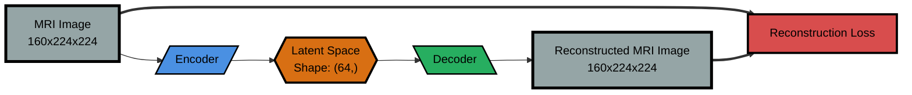

```mermaid

graph LR
    %% Styling for different components
    classDef encoder fill:#4A90E2,stroke:#000000,stroke-width:2px,color:#000
    classDef latent fill:#d86f13,stroke:#000000,stroke-width:3px,color:#000
    classDef decoder fill:#27AE60,stroke:#000000,stroke-width:2px,color:#000
    classDef input fill:#95A5A6,stroke:#000000,stroke-width:4px,color:#000
    classDef loss fill:#d84d4d,stroke:#000000,stroke-width:3px,color:#000
    
    %% Input Layer
    Input["MRI Image<br/>160x224x224"]
    
    %% Encoder Layer
    Encoder[/"Encoder"/]
    
    %% Latent Space (Bottleneck)
    Latent{{"Latent Space<br/>Shape: (64,)"}}
    
    %% Decoder Layer
    Decoder[\"Decoder"\]
    
    %% Output Layer
    Output["Reconstructed MRI Image<br/>160x224x224"]

    %% Reconstruction Loss
    Loss["Reconstruction Loss"]
    
    %% Connections
    Input --> Encoder
    Input ==> Loss
    Encoder --> Latent
    Latent --> Decoder
    Decoder --> Output
    Output ==> Loss
    
    %% Apply styles
    class Input,Output input
    class Encoder encoder
    class Latent latent
    class Decoder decoder
    class Loss loss
```