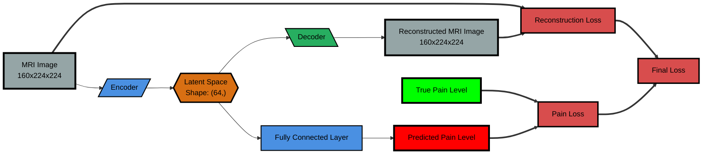

```mermaid

graph LR
    %% Styling for different components
    classDef encoder fill:#4A90E2,stroke:#000000,stroke-width:2px,color:#000
    classDef decoder fill:#27AE60,stroke:#000000,stroke-width:2px,color:#000
    classDef latent fill:#d86f13,stroke:#000000,stroke-width:3px,color:#000
    classDef input fill:#95A5A6,stroke:#000000,stroke-width:4px,color:#000
    classDef pain fill:#ff0000,stroke:#000000,stroke-width:4px,color:#000
    classDef truepain fill:#00ff00,stroke:#000000,stroke-width:4px,color:#000
    classDef loss fill:#d84d4d,stroke:#000000,stroke-width:3px,color:#000
    
    %% Input Layer
    Input["MRI Image<br/>160x224x224"]
    
    %% Encoder Layer
    Encoder[/"Encoder"/]

    %% Decoder Layer
    Decoder[\"Decoder"\]

    %% Output Layer
    Output["Reconstructed MRI Image<br/>160x224x224"]
    
    %% Latent Space (Bottleneck)
    Latent{{"Latent Space<br/>Shape: (64,)"}}

    %% Fully Connected Layer
    FC["Fully Connected Layer"]

    %% Predicted Pain Layer
    Pain["Predicted Pain Level"]

    %% Real Pain Layer
    TruePain["True Pain Level"]

    %% Pain Loss
    PainLoss["Pain Loss"]

    %% Reconstruction Loss
    ReconLoss["Reconstruction Loss"]

    %% Final Loss
    FinalLoss["Final Loss"]
    
    %% Connections
    Input --> Encoder
    Input ==> ReconLoss
    Encoder --> Latent
    Latent --> FC
    Latent --> Decoder
    Decoder --> Output
    Output ==> ReconLoss
    FC --> Pain
    Pain ==> PainLoss
    TruePain ==> PainLoss
    PainLoss ==> FinalLoss
    ReconLoss ==> FinalLoss
    
    %% Apply styles
    class Input input
    class Encoder encoder
    class Latent latent
    class Decoder decoder
    class Output input
    class PainLoss loss
    class ReconLoss loss
    class FinalLoss loss
    class Pain pain
    class TruePain truepain
    class FC encoder
```