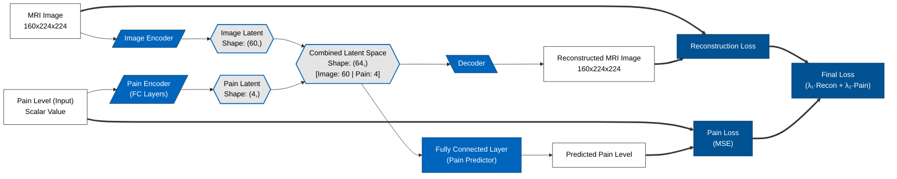

```mermaid
graph LR
    %% Styling for different components
    classDef encoder fill:#0065BD,stroke:#003359,stroke-width:1px,color:#fff
    classDef decoder fill:#0065BD,stroke:#003359,stroke-width:1px,color:#fff
    classDef latent fill:#E5E5E5,stroke:#0065BD,stroke-width:2px,color:#000
    classDef input fill:#FFFFFF,stroke:#333333,stroke-width:1px,color:#000
    classDef pain fill:#FFFFFF,stroke:#333333,stroke-width:1px,color:#000
    classDef truepain fill:#FFFFFF,stroke:#333333,stroke-width:1px,color:#000
    classDef loss fill:#005293,stroke:#003359,stroke-width:1px,color:#fff
    classDef combine fill:#E5E5E5,stroke:#0065BD,stroke-width:2px,color:#000
    
    %% Input Layers
    MRIInput["MRI Image<br/>160x224x224"]
    PainInput["Pain Level (Input)<br/>Scalar Value"]
    
    %% Encoder Branches
    ImageEncoder[/"Image Encoder"/]
    PainEncoder[/"Pain Encoder<br/>(FC Layers)"/]
    
    %% Latent Space Components
    ImageLatent{{"Image Latent<br/>Shape: (60,)"}}
    PainLatent{{"Pain Latent<br/>Shape: (4,)"}}
    CombinedLatent{{"Combined Latent Space<br/>Shape: (64,)<br/>[Image: 60 | Pain: 4]"}}
    
    %% Decoder Branch
    Decoder[\"Decoder"\]
    
    %% Pain Prediction Branch
    PainFC["Fully Connected Layer<br/>(Pain Predictor)"]
    PredictedPain["Predicted Pain Level"]
    
    %% Output Layer
    Output["Reconstructed MRI Image<br/>160x224x224"]
    
    %% Loss Components
    ReconLoss["Reconstruction Loss"]
    PainLoss["Pain Loss<br/>(MSE)"]
    FinalLoss["Final Loss<br/>(λ₁·Recon + λ₂·Pain)"]
    
    %% Connections - Main Flow
    MRIInput --> ImageEncoder
    PainInput --> PainEncoder
    
    ImageEncoder --> ImageLatent
    PainEncoder --> PainLatent
    
    ImageLatent --> CombinedLatent
    PainLatent --> CombinedLatent
    
    CombinedLatent --> Decoder
    CombinedLatent --> PainFC
    
    Decoder --> Output
    PainFC --> PredictedPain
    
    %% Loss Connections
    MRIInput ==> ReconLoss
    Output ==> ReconLoss
    PainInput ==> PainLoss
    PredictedPain ==> PainLoss
    
    ReconLoss ==> FinalLoss
    PainLoss ==> FinalLoss
    
    %% Apply styles
    class MRIInput input
    class PainInput pain
    class ImageEncoder encoder
    class PainEncoder encoder
    class ImageLatent latent
    class PainLatent latent
    class CombinedLatent combine
    class Decoder decoder
    class PainFC encoder
    class Output input
    class PredictedPain truepain
    class ReconLoss loss
    class PainLoss loss
    class FinalLoss loss
```