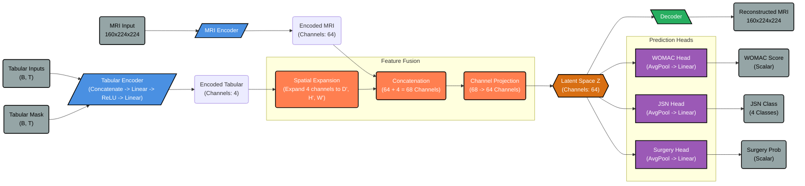

```mermaid
graph LR
    %% Styling for different components
    classDef encoder fill:#4A90E2,stroke:#000000,stroke-width:2px,color:#fff
    classDef decoder fill:#27AE60,stroke:#000000,stroke-width:2px,color:#fff
    classDef latent fill:#d86f13,stroke:#000000,stroke-width:2px,color:#fff
    classDef input fill:#95A5A6,stroke:#000000,stroke-width:2px,color:#000
    classDef head fill:#9B59B6,stroke:#000000,stroke-width:2px,color:#fff
    classDef operation fill:#FF7F50,stroke:#000000,stroke-width:2px,color:#fff

    %% Input Layers
    MRIInput("MRI Input<br/>160x224x224"):::input
    TabInput("Tabular Inputs<br/>(B, T)"):::input
    MaskInput("Tabular Mask<br/>(B, T)"):::input

    %% Encoders
    MRIEncoder[/"MRI Encoder"/]:::encoder
    TabEncoder[/"Tabular Encoder<br/>(Concatenate -> Linear -> ReLU -> Linear)"/]:::encoder
    
    %% Intermediate States
    MRIEncoded("Encoded MRI<br/>(Channels: 64)")
    TabEncoded("Encoded Tabular<br/>(Channels: 4)")

    %% Fusion Block
    subgraph Fusion [Feature Fusion]
        direction TB
        Expand("Spatial Expansion<br/>(Expand 4 channels to D', H', W')"):::operation
        Concat("Concatenation<br/>(64 + 4 = 68 Channels)"):::operation
        Project("Channel Projection<br/>(68 -> 64 Channels)"):::operation
    end

    %% Latent Space
    LatentZ{{"Latent Space Z<br/>(Channels: 64)"}}:::latent

    %% Decoder Branch
    Decoder[\"Decoder"\]:::decoder
    ReconOutput("Reconstructed MRI<br/>160x224x224"):::input

    %% Prediction Heads
    subgraph Heads [Prediction Heads]
        WOMACHead["WOMAC Head<br/>(AvgPool -> Linear)"]:::head
        JSNHead["JSN Head<br/>(AvgPool -> Linear)"]:::head
        SurgeryHead["Surgery Head<br/>(AvgPool -> Linear)"]:::head
    end

    %% Predictions
    WOMACPred("WOMAC Score<br/>(Scalar)"):::input
    JSNPred("JSN Class<br/>(4 Classes)"):::input
    SurgeryPred("Surgery Prob<br/>(Scalar)"):::input

    %% Connections
    MRIInput --> MRIEncoder --> MRIEncoded
    TabInput & MaskInput --> TabEncoder --> TabEncoded
    
    MRIEncoded --> Concat
    TabEncoded --> Expand --> Concat
    
    Concat --> Project --> LatentZ
    
    LatentZ --> Decoder --> ReconOutput
    
    LatentZ --> WOMACHead --> WOMACPred
    LatentZ --> JSNHead --> JSNPred
    LatentZ --> SurgeryHead --> SurgeryPred
```