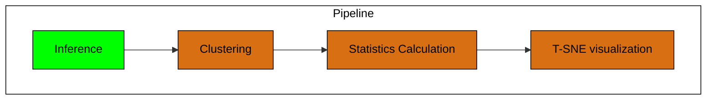

```mermaid

graph LR
    %% Styling for different components
    classDef pipeline fill:#ffffff,stroke:#000000,stroke-width:1px,color:#000,font-size:16px
    classDef beginning fill:#00ff00,stroke:#000000,color:#000
    classDef othersteps fill:#d86f13,stroke:#000000,color:#000

    subgraph Pipeline[Pipeline]
        direction LR
        Inference["Inference"]
        Clustering["Clustering"]
        Statistics["Statistics Calculation"]
        Tsne["T-SNE visualization"]
    end

    Inference --> Clustering
    Clustering --> Statistics
    Statistics --> Tsne


    class Pipeline pipeline
    class Inference beginning
    class Clustering othersteps
    class Statistics othersteps
    class Tsne othersteps
```